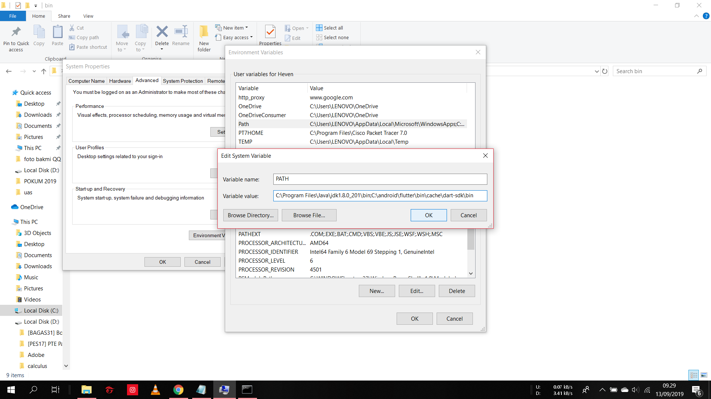

# installflutter
NAMA : HEVEN
NIM : 20175520002
PRODI : TEKNIK INFORMATIKA
MATA KULIAH : PEMROGRAMAN MOBILE (COE-5109)

INSTALL FLUTTER TANPA ANDROID STUDIO  

Langkah-langkah instalasi flutter (spesifikasi ringan) :  
1. Download SDK Flutter. Silahkan kunjungi halaman download disini, dan sesuaikan dengan sistem operasi teman teman. saat tulisan ini dibuat flutter dalam versi 1.2.1 Stable.  
2. Selanjutnya silahkan download Command Line Tools Only di halaman ini , penampakan nya seperti berikut, silahkan download sesuai sistem operasi yang digunakan. 
 
3. Silahkan Ekstrak kedua file tersebut dan letakkan di C:\Android untuk windows dan untuk sistem operasi yang lainnya bisa menaruh di root dan buat folder Android. Maka hasilnya akan ada 2 folder yaitu folder flutter dan tools. 
<
4. sampai sini kita harus menge-set Environment Variable dan Path, untuk windows silahkan buka command prompt dan ketikan command perbaris.  
  setx JAVA_HOME “C:\Android\openjdk”  
  setx ANDROID_HOME “C:\Android”  
  setx ANDROID_SDK_ROOT “C:\Android\tools”   
  setx path “%path%;”C:\Android\sdk;C:\Android\tools\bin;C:\Android\flutter\bin”  
   
5. Buka terminal (Command Prompt) di C:/Android/tools/bin lalu ketikan beberapa perintah berikut. sdkmanager “system-images;android-28;default;x86_64” sdkmanager “platform-tools” sdkmanager “build-tools;28.0.3” sdkmanager “platforms;android-28”. 

sdkmanager “system-images;android-28;default;x86_64”  
 
 
sdkmanager “platform-tools”  
 
 
sdkmanager “build-tools;28.0.3” 
 
 
sdkmanager “platforms;android-28” 
 
 
6. Selanjutnya install Visual Studio Code dan ekstension flutter serta dart nya. 
 

7. Step terakhir adalah buat project di VsCode dengan klik F1 dan mengetikan Flutter: New Project setelah project selesai di load, klik F5 untuk mendeploy ke android device teman-teman. 

 

